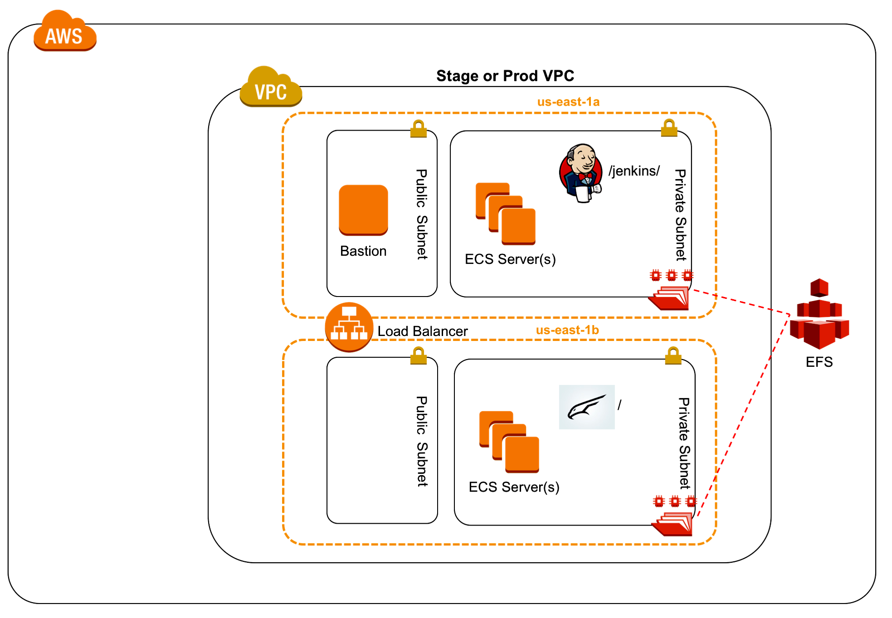

### Setup

* Configure DNS using a Route53 hosted domain
  * Create a new hosted domain in the challenge account that's a subdomain of a domain we already own
  * Create a delegation record in the parent domain/zone
    * Copy the NS records from the new subdomain and make a new NS record in the parent domain delegating control of the subdomain
* Request a new star cert from Amazon Certificate Manager
  * Use the blue, "Easy button" to create the proof of domain ownership DNS record
  * Once issued the ARN of the cert will be passed to the terraform templates via an environment variable
* [Create an EC2 SSH keypair](https://docs.aws.amazon.com/AWSEC2/latest/UserGuide/ec2-key-pairs.html)
* Initialize the terraform project and set up multiple environments
  * `cd pipeline/terraform`
  * `terraform init`
  * `terraform workspace new prod`
  * `terraform workspace new stage`
* Configure the project settings
  * [Create an AWS CLI named profile](https://docs.aws.amazon.com/cli/latest/userguide/cli-multiple-profiles.html)
  * [Create an MFA enabled cli profile](https://aws.amazon.com/premiumsupport/knowledge-center/authenticate-mfa-cli/)
    * Convenience script:
      ```sh
      # use your own values
      ./create_cred_snip.sh --mfa-serial='arn:aws:iam::123YOURNUMBER456:mfa/Your.Name' --profile=profile_name_from_previous_step --token-code=token_code_from_authenticator
      ```
  * Copy, update and source the example environment variables file
  * `cp env.sh.example env.sh`
  * edit file
  * `source env.sh`
* Build stage environment infrastructure
  * `terraform apply`

### Configure

* Update EFS throughput mode to something like 10MiB/s provisioned through the UI
* Copy the public IP of the bastion host and configure an ssh connection
* Copy the private IP of the ECS host and configure an ssh connection
  * Bastion IP: `terraform output -module=bastion public_ip`
  * Example ssh config
    ```
    # ~/.ssh/config
    
    Host eagle-<YOUR_WORKSPACE_NAME>-bastion
        HostName <EC2_PUBLIC_IP>
        Port 443
        IdentityFile ~/.ssh/<YOUR_KEY>.pem
    
    Host eagle-<YOUR_WORKSPACE_NAME>-ecs
        HostName <EC2_PRIVATE_IP>
        ProxyJump eagle-<YOUR_WORKSPACE_NAME>-bastion
        IdentityFile ~/.ssh/<YOUR_KEY>.pem
    
    Host eagle-<YOUR_WORKSPACE_NAME>-ecs
        HostName <EC2_PRIVATE_IP>
        ProxyJump eagle-<YOUR_WORKSPACE_NAME>-bastion
        IdentityFile ~/.ssh/<YOUR_KEY>.pem
    
    Host eagle-*
        User ec2-user
        ServerAliveInterval 60
    ```
* (Optional) ssh into the ECS host and ensure the NFS filesystem has been mounted, this is done as part of the userdata script
  ```sh
  $ ls -al /mnt/efs
  total 12
  drwxr-xr-x  3 root root 6144 Jul 23 22:29 .
  drwxr-xr-x  3 root root 4096 Jul 23 22:27 ..
  drwxr-xr-x 15 1000 1000 6144 Jul 23 22:33 jenkins
  ```
* (Optional) Monitor the status of the Jenkins container by periodically running `docker ps`
  * Once it starts switch to `docker logs -f CONTAINER_ID` to see when it's finished bootstrapping
  * If you wait ~5 minutes it will bootstrap entirely on its own, the commands above are just if you want to follow along
* Create a new A/Alias record that points at either the apex (blank) for prod or a specific environment name like stage to the load balancer
* Navigate to the `/jenkins` context on the load balancer using the DNS name we configured in the last step
* Create the Jenkins admin user with an initial password found with
  ```sh
  sudo cat /mnt/efs/jenkins/secrets/initialAdminPassword
  ```
* Choose `Install suggested plugins`. (These were already downloaded as part of the automation mentioned above, so installation is quick.)
* Create a pipeline job for the eagle application
  * Pipeline Definition: `Pipeline script from SCM`
  * SCM: `Git`
    * Repository URL: `https://github.com/ICFI/eagle.git`
    * Script Path: `application/Jenkinsfile`
  * "Save" button
  * "Build Now" left-hand menu link
  
### Result

At the end of the deployment the following resources will have been provisioned.

* VPC with two public and two private subnets
* An optional bastion host which allows for console access to resources in private subnets
* An ECS cluster provisioned within the private subnet
* A Jenkins container with a `JENKINS_HOME` directory mounted from an EFS volume to persist state
* An eagle container built from the source at the root of this project
* An application load balancer

### Links
* EC2 -> Load Balancers link in the left-hand menu -> Select the ALB and copy the DNS name
* **`/jenkins/`** - to access jenkins
* **`/`** - access application once first build has successfully completed


